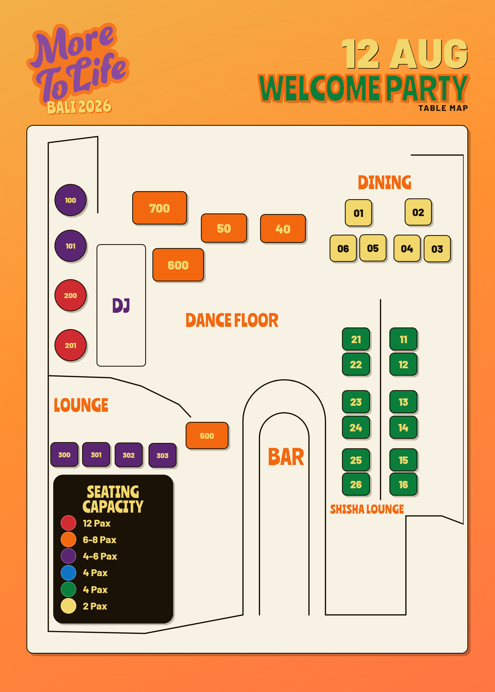

# Codex Brief — Convert Table Maps from PNG to Live HTML

## Goal

Replace the four static PNG table maps on `/booths.html` with **live HTML/CSS maps**, so that:

1. Sold-out booths show **grey + a red X** directly on the map (Option A), not just in the side panel.
2. Clicking a booth **on the map** selects it — same as clicking it in the side panel today. Both stay in sync.
3. One source of truth (`booths.js` CONFIG) drives sold-state and price everywhere — no more re-exporting a PNG from Fahad every time a booth sells.

## Where this data came from

The four maps were originally built in Claude Design as data-driven components (not flat images) — each booth was already a distinct element positioned by exact x/y coordinates. This package is the result of converting that source into plain, dependency-free HTML/CSS that runs in any browser (no Claude Design runtime required).

## Files in this package

```
welcome-party.html     ← map partial (drop into booths.html)
no-signal.html         ← map partial
nights-in-bali.html    ← map partial
send-off.html          ← map partial
maps.css               ← shared styles for all four maps (chips, zones, sold-out state)
maps.js                ← wires sold-state + click-to-select sync into booths.js
images/mtl-logo.png    ← small MTL logo used inside each map's corner badge
MAPS_HANDOFF.md         ← this file
```

## ⚠️ Required fix before wiring anything up

The Send-Off map's source labels its four small tables **`HIGH Table 1`–`4`** (all caps — this is baked into the map's `data-code` attributes). The current `booths.js` CONFIG has these as **`High Table 1`–`4`** (title case). These strings must match **exactly** or the map ↔ pane sync will silently fail for those four booths.

**Fix in `booths.js`** — in `CONFIG.events['The Send-Off (17 Aug)']`, find:
```js
{ name: 'High Tables', capacity: '4 pax', booths: [
  { code: 'High Table 1', price: '$TBC' },
  { code: 'High Table 2', price: '$TBC' },
  { code: 'High Table 3', price: '$TBC' },
  { code: 'High Table 4', price: '$TBC' }
]}
```
Replace with:
```js
{ name: 'High Tables', capacity: '4 pax', booths: [
  { code: 'HIGH Table 1', price: '$TBC' },
  { code: 'HIGH Table 2', price: '$TBC' },
  { code: 'HIGH Table 3', price: '$TBC' },
  { code: 'HIGH Table 4', price: '$TBC' }
]}
```
(Every other booth code across all four events already matches the map data exactly — verified programmatically, no other changes needed.)

## Step 1 — Add a `sold` flag to CONFIG (replaces "delete the line" workflow)

Previously, marking a booth sold meant deleting its entry from `booths.js`. That still works for the **pane**, but the **map** needs to know a booth existed and is sold (to show grey + X), not just have it vanish. So switch to a boolean flag instead of deletion:

```js
{ code: 'CB3', price: '$850 AUD' },              // available
{ code: 'CB2', price: '$850 AUD', sold: true },  // sold — greyed + crossed out on map, hidden from pane
```

This is also just nicer to maintain — flipping `sold: true` / `false` is a one-word edit; deleting and re-adding a line risks typos in the code or price when a booking falls through and the booth needs to go back on sale.

## Step 2 — Update the pane's rendering loop in `booths.js`

Find the category-rendering loop (inside the block that builds `.category` elements per event panel). It currently renders every booth in `cat.booths`. Change it to **filter out sold booths** before rendering, so the pane behaviour (sold booths disappear from the list) is preserved:

**Before:**
```js
cats.forEach(cat => {
  if (!cat.booths || cat.booths.length === 0) return;

  const catEl = document.createElement('div');
  catEl.className = 'category';
  catEl.innerHTML = `
    <div class="cat-head">
      <span class="cat-name">${cat.name}</span>
      <span class="cat-meta">${cat.capacity} · ${cat.booths.length} available</span>
    </div>
    <div class="booths"></div>
  `;
  const boothsEl = catEl.querySelector('.booths');
  cat.booths.forEach(b => {
    const btn = document.createElement('button');
    btn.className = 'booth';
    const priceDisplay = b.price ? b.price : 'Enquire';
    btn.innerHTML = `<span class="code">${b.code}</span><span class="price">${priceDisplay}</span>`;
    const priceForMsg = b.price ? ` (${b.price})` : '';
    btn.dataset.booth = `${cat.name} — ${b.code}${priceForMsg}`;
    btn.addEventListener('click', () => selectBooth(panel, btn));
    boothsEl.appendChild(btn);
  });
  catsContainer.appendChild(catEl);
});
```

**After:**
```js
cats.forEach(cat => {
  const available = cat.booths.filter(b => !b.sold);
  if (available.length === 0) return; // whole category sold out — hide it

  const catEl = document.createElement('div');
  catEl.className = 'category';
  catEl.innerHTML = `
    <div class="cat-head">
      <span class="cat-name">${cat.name}</span>
      <span class="cat-meta">${cat.capacity} · ${available.length} available</span>
    </div>
    <div class="booths"></div>
  `;
  const boothsEl = catEl.querySelector('.booths');
  available.forEach(b => {
    const btn = document.createElement('button');
    btn.className = 'booth';
    const priceDisplay = b.price ? b.price : 'Enquire';
    btn.innerHTML = `<span class="code">${b.code}</span><span class="price">${priceDisplay}</span>`;
    const priceForMsg = b.price ? ` (${b.price})` : '';
    btn.dataset.booth = `${cat.name} — ${b.code}${priceForMsg}`;
    btn.addEventListener('click', () => selectBooth(panel, btn));
    boothsEl.appendChild(btn);
  });
  catsContainer.appendChild(catEl);
});
```

Only real change: `cat.booths` → `available` (a pre-filtered array), in three places.

## Step 3 — Replace the four `` maps in `booths.html`

Each event section currently has:
```html
<div class="map-wrap">
  
  <div class="map-caption">...</div>
</div>
```

Replace the `` with the matching partial's contents, wrapped for horizontal scroll on small screens:
```html
<div class="map-wrap">
  <div class="mtl-map-scale-wrap">
    <!-- paste the full contents of welcome-party.html here -->
  </div>
  <div class="map-caption">...</div>
</div>
```

Do this once per event, using:
- `welcome-party.html` → Welcome Party section
- `no-signal.html` → No Signal section
- `nights-in-bali.html` → Nights in Bali section
- `send-off.html` → The Send-Off section

The four PNG files (`WELCOME_PARTY_-_Table_Map.png` etc.) are no longer used by the page and can stay in `images/` as a backup, or be removed once this is confirmed working.

## Step 4 — Add the new assets

1. Copy `images/mtl-logo.png` from this package into the site's `images/` folder (don't overwrite anything — check the filename isn't already taken; rename to `mtl-logo-small.png` if it collides).
2. Add both new stylesheets/scripts to `booths.html`'s `<head>` / before `</body>`:
   ```html
   <link rel="stylesheet" href="booths.css">
   <link rel="stylesheet" href="maps.css">   <!-- new -->
   ...
   <script src="booths.js" defer></script>
   <script src="maps.js" defer></script>     <!-- new, load AFTER booths.js -->
   ```
3. Add the Ranchers font (the maps use it for titles) alongside the existing Barlow Condensed import:
   ```html
   <link href="https://fonts.googleapis.com/css2?family=Ranchers&family=Barlow:wght@500;600;700;800;900&display=swap" rel="stylesheet">
   ```
   This is a **second** font family used only inside the map graphics — it does not affect the rest of the page, which keeps Barlow Condensed throughout (per the earlier decision to keep the maps' own poster identity distinct from the site's editorial type).

## How the sync works (for your reference — no action needed)

- On page load, `maps.js` reads `CONFIG.events` from `booths.js`, finds every booth with `sold: true`, and adds a `.mtl-chip--sold` class to the matching chip on the map (matched by its `data-code` + `data-event` attributes). CSS in `maps.css` renders that as grey + red X and disables clicks on it.
- Clicking a live (non-sold) chip on the map finds the equivalent chip in the side panel (by matching the booth code text) and **clicks it programmatically** — this reuses 100% of the existing `selectBooth()` logic in `booths.js` (pill update, WhatsApp/Instagram message pre-fill) rather than duplicating it. The map chip also gets a white outline to show it's the active selection.
- Nothing about the WhatsApp/Instagram enquiry flow changes — this only affects how sold-state and selection are visualized.

## Testing checklist

- [ ] All four maps render correctly at full width — compare visually against the original PNGs (`Nights In Bali`, `No Signal`, `The Send-Off`, `Welcome Party`) to confirm zones, colours, and chip positions match.
- [ ] Setting `sold: true` on any booth (try `CB3` in Nights in Bali) greys it out **and** crosses it with a red X on the live map, and removes it from the side panel list.
- [ ] Un-setting `sold: true` brings the booth back on both the map and the panel.
- [ ] Clicking an available chip directly on the map selects it in the side panel (pill appears, WhatsApp/Instagram messages update) exactly as if it had been clicked in the panel.
- [ ] Clicking a sold (crossed-out) chip on the map does nothing.
- [ ] The four `HIGH Table` codes in The Send-Off work correctly after the case-sensitivity fix in Step 0 — test selecting `HIGH Table 1` from both the map and the panel.
- [ ] Mobile (≤560px): maps scale down and are horizontally scrollable rather than overflowing the page.
- [ ] Ranchers font loads correctly for map titles ("NIGHTS IN BALI", "NO SIGNAL", etc.) — the rest of the page (nav, body text, booth codes in the side panel) stays in Barlow Condensed, unaffected.
